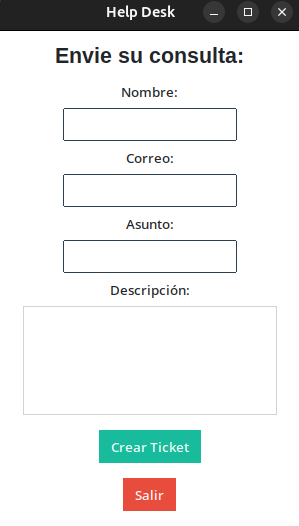

# Formulario de Help Desk

## Propósito del Proyecto

Este proyecto resuelve el problema de gestionar solicitudes de soporte de manera sencilla y eficiente. Proporciona una interfaz intuitiva para que los usuarios envíen tickets de soporte, los cuales son almacenados localmente y notificados al administrador por correo. Es ideal para pequeñas organizaciones o entornos educativos que necesitan un sistema ligero de gestión de incidencias sin depender de software comercial.

## Características

* Interfaz gráfica moderna con ttkbootstrap.
* Creación de tickets con nombre, correo, asunto y descripción.
* Almacenamiento de tickets en `tickets.json`.
* Notificación automática por correo al administrador.

## Requisitos

* **Sistema operativo:** Linux (probado en Ubuntu, compatible con otras distribuciones).
* **Python:** 3.8 o superior.
* **Dependencias:**

  * `ttkbootstrap==1.14.0` (para la interfaz gráfica)
  * `pillow==10.4.0` (dependencias)

## Instalación

Sigue estos pasos para instalar y ejecutar el proyecto en un entorno Linux:

### 1. Clonar o descargar el proyecto

```bash
git clone https://github.com/bautiCap/final.git  # Reemplaza con la URL si usas un repositorio
```

### 2. Crear y activar un entorno virtual

```bash
python3 -m venv venv
source venv/bin/activate
```

### 3. Instalar dependencias

```bash
pip install -r requirements.txt
```

Esto instalará `ttkbootstrap` y sus dependencias (como `pillow`).

### 4. Configurar el correo (IMPORTANTE)

Abre el archivo `servicio_smtp.py` y modifica las siguientes variables con tus datos:

```python
SMTP_USER = "your_email@gmail.com"  # Tu dirección de correo Gmail
SMTP_PASS = "your_app_password"     # Contraseña de aplicacion de Google de la cuenta asociada al Gmail
ADMIN_EMAIL = "admin@example.com"   # Correo del administrador que recibirá los tickets
```

**Cómo obtener `SMTP_PASS`:**

1. Ve a la configuración de seguridad de tu cuenta de Google.
2. Habilita la verificación en dos pasos.
3. Genera una contraseña de aplicación para "Correo" y úsala como `SMTP_PASS`.

tutorial: https://www.youtube.com/watch?v=xnbGakU7vhE

### 5. Crear el archivo `tickets.json` (si no existe)

```bash
echo "[]" > tickets.json
chmod 600 tickets.json
```

## Uso

### Ejecutar el programa

```bash
python3 main.py
```

### Interfaz



* Se abrirá una ventana con un formulario.
* Completa los campos: Nombre, Correo, Asunto y Descripción.
* Haz clic en **Crear Ticket** para generar un ticket y enviarlo al administrador.
* Haz clic en **Salir** para cerrar la aplicación.

### Verificación

* Los tickets se guardan en `tickets.json` en el directorio del proyecto.


* Revisa el correo del administrador (especificado en `ADMIN_EMAIL`) para confirmar la recepción del ticket.


## Estructura de Archivos

```
help_desk/
├── main.py           # Interfaz gráfica con ttkbootstrap
├── tickets.py        # Gestión de tickets (creación y almacenamiento)
├── servicio_smtp.py  # Envío de correos al administrador
├── README.md         # Documentación del proyecto
├── requirements.txt  # Librerias y dependencias
├── capturas          # Imagenes
```


### Herramientas y bibliotecas

* Python 3 – Lenguaje de programación principal
* ttkbootstrap – Biblioteca para la interfaz gráfica moderna (v1.10.1)
* Pillow – Dependencia de ttkbootstrap para manejo de imágenes
* smtplib – Módulo estándar de Python para envío de correos
* json – Módulo estándar de Python para manejo de archivos JSON
* uuid – Módulo estándar para generar identificadores únicos
* datetime – Módulo estándar para fechas
* os – Módulo estándar para gestión de archivos


## Notas

* Asegúrate de que el **puerto 587** esté abierto para el envío de correos (SMTP).
* Usa permisos seguros para poder escribir en el archivo `tickets.json`:

```bash
chmod 600 tickets.py servicio_smtp.py
```


## Limitaciones

* No incluye autenticación de usuarios ni visualización de tickets en la interfaz.
* Depende de una conexión a internet para enviar correos.

## Créditos

* **Autor:** Desarrollado por *Bautista Capano*.
* **Contacto:** *bautista.capano@istea.com*.

